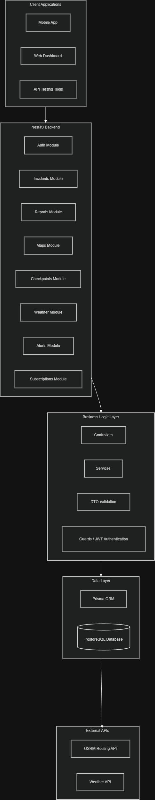
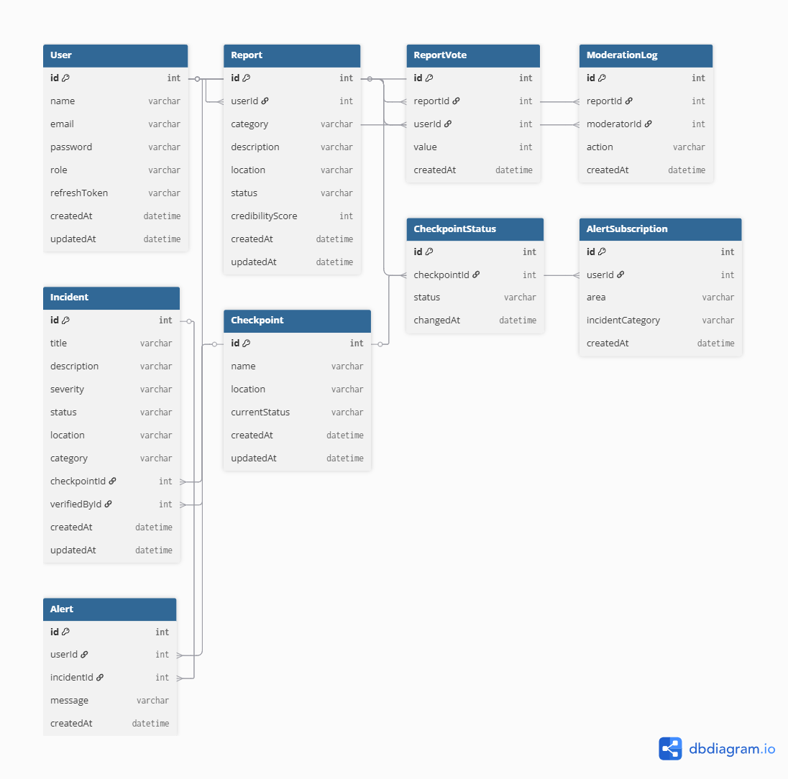

# Wasel Palestine Backend

## System Overview
Wasel Palestine is a backend API system designed to support smart mobility and checkpoint intelligence in Palestine.

The platform provides structured and reliable data about incidents, checkpoints, routes, alerts, reports, and contextual information such as weather.

This project focuses on backend engineering only, including:
- RESTful API design
- Relational database modeling
- Authentication and authorization
- External API integration
- Performance testing
- Reliability and maintainability

---

## Technology Stack
- NestJS
- TypeScript
- Prisma ORM
- PostgreSQL
- Docker
- JWT Authentication
- k6 for performance testing

---

## Main Features

### Authentication
- Login & Register
- JWT tokens (access + refresh)
- Protected routes

### Incidents & Checkpoints
- Manage incidents
- Track checkpoints
- Filtering & pagination

### Reports
- Users submit reports
- Validation & duplicate detection

### Routes
- Distance & duration estimation
- Avoid checkpoints

### Alerts
- Subscriptions by area
- Alert system ready

### External APIs
- Weather API
- Routing API

---

## API Design

All endpoints follow versioned REST structure:

`/api/v1/...`

### Main Modules
- /auth
- /incidents
- /reports
- /maps
- /checkpoints
- /weather
- /alerts
- /subscriptions

### Design Goals
- Modular
- Versioned
- Easy to use
- Secure with JWT

---

## Database (ERD)

User:
- id, name, email, password, role

Report:
- id, category, location, description, createdAt, userId

Incident:
- id, title, description, category, severity, status, location, createdAt

Checkpoint:
- id, name, location, status

CheckpointHistory:
- id, checkpointId, oldStatus, newStatus, changedAt

Subscription:
- id, userId, area, incidentCategory

Alert:
- id, userId, incidentId, createdAt

---
## Architecture

- Controllers → handle requests
- Services → business logic
- Prisma → database
- Modules → structure

---

## External APIs

Routing API:
- distance
- duration

Weather API:
- environmental data

---

## Validation
- DTO validation
- duplicate detection
- request validation

---

## Authentication
- JWT based
- Access + Refresh tokens

Header:
Authorization: Bearer <token>

---

## Testing

### API Testing
- API-Dog

### Performance Testing (k6)

Read Test:
- GET /incidents
- 10 users
- 10 seconds
- 100% success

Write Test:
- POST /reports
- with valid token

Other:
- Mixed load
- Spike test
- Soak test

---
## Performance Report

### Test Scenarios
The system was evaluated using k6 under the following workloads:
- Read-heavy workload
- Write-heavy workload
- Mixed workload
- Spike testing
- Soak testing

### Metrics Reported
- Average response time
- p95 latency
- Throughput
- Error rate

### Results Summary

#### Read-heavy
- Endpoint: `GET /api/v1/incidents`
- Virtual Users: 10
- Duration: 10 seconds
- Success Rate: 100%
- Error Rate: 0%
- Average Response Time: ~40 ms
- Throughput: stable under concurrent access

#### Write-heavy
- Endpoint: `POST /api/v1/reports`
- Virtual Users: 10
- Duration: 10 seconds
- Authentication required valid JWT token
- Main issue observed: invalid token caused failed requests during early tests
- After correcting the token, requests were processed correctly

#### Mixed Workload
- Combined read and write requests
- Used to evaluate behavior under realistic mixed traffic
- System remained stable with acceptable response times

#### Spike Testing
- Sudden increase in virtual users
- Used to evaluate resilience under unexpected traffic spikes
- System remained responsive, with temporary increase in latency under peak load

#### Soak Testing
- Sustained workload over longer duration
- Used to verify stability over time
- No major memory or crash issues were observed during the test period

### Observed Limitations
- Authentication errors affected write-heavy testing before valid tokens were used
- Write operations are more sensitive than read operations under concurrent load
- External API calls may introduce extra latency

### Root Causes
- Invalid JWT token configuration during initial write testing
- Added latency from external API communication
- Higher processing cost for database write operations compared to reads

### Optimizations Applied
- Corrected authentication token usage
- Used caching for route-related operations
- Improved request validation and reduced repeated invalid submissions

### Before / After Comparison
- Before optimization: write-heavy tests failed due to invalid token errors
- After optimization: authenticated requests were accepted correctly
- Before optimization: some route requests were slower
- After optimization: caching improved response efficiency

### Bottlenecks
- JWT authentication issues during protected write requests
- External API dependency latency
- Database writes under concurrent submissions

---
## Project Structure

src/
- auth/
- incidents/
- reports/
- maps/
- checkpoints/
- weather/

prisma/
test/

---

## Run Project

npm install  
npm run start:dev  

---

## Docker
- Dockerfile
- docker-compose.yaml

---

## Git Workflow
- GitHub repository was used for version control
- Development was organized using branches
- Changes were tracked through commits
- Pull requests were used to merge changes into the main branch
- Repository was kept private before submission

---

## Notes
Course project – Spring 2026

---

## Team Work
- API development
- Database design
- Testing
- Documentation

